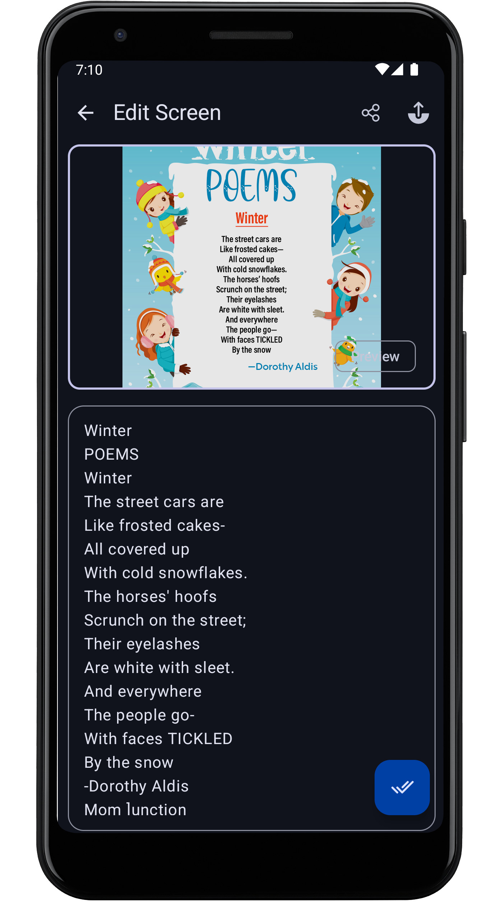
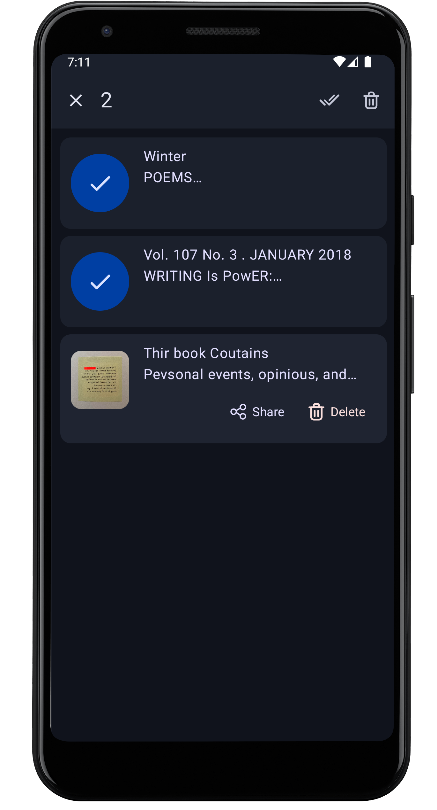
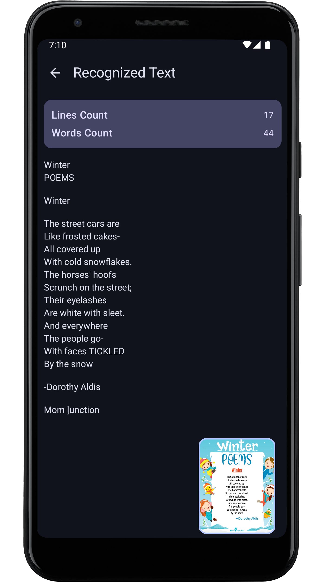

# Image2TextReader App

## 📔 About

Image2TextApp is an Android application that utilizes Google's OCR ML Kit to recognize text within
images. Built with modern Android development features, it offers a seamless user experience for
extracting and managing text from images.

## 👉 Features

- **Image Selection**: Upload images from your device's gallery. Utilize Google's OCR ML Kit for
  accurate text recognition from various image
  formats.
- **Word Identification**: Split the recognized text into individual words for easy review and
  modification.
- **Correction & Modification**: Edit misidentified words or manually refine the extracted text.
- **Text Saving**: Save the extracted text as a TXT file on your device's shared storage for later
  use.

## Screenshots

These are some of the screenshots of the app:

  
  
  
  

## 🎁 Contributing

If you would like to contribute to [this app](https://github.com/tuuhin/Image2TextReaderApp), follow
these steps:

1. Fork the repository on GitHub.
2. Create a new branch with your changes.
3. Commit your changes and push your branch to your fork.
4. Submit a pull request to the main repository.

### ❤️‍🩹 Additional Information

Though the app seems a bit clean,There is some problem mainly with file caching, there is some
problem with saving the images, the approach used here to re-save the files in-app level files
storage.
Thus, saving big files may take some time.

## 🔚 Conclusion

This project's main feature as the name speaks to convert image to a text via on device ml. Yes,
there are some flaws and many UX mistakes mentioned in addition info, but the main goal is reached
and a decent project is made. If someone finds any changes that can be applied, please add an issue.
